</img>

  

## About Me

- Currently working at **Kratos Defense & Security Solutions**.
- Specialize in **Microservice Architecture, Middleware Design, SATCOM, Ground Systems, & C2 Services**.
- 2019 Graduate of **Salisbury University** with a Bachelor's in **Computer Science**.
- My GitHub is for personal projects, learning new tools/languages, & contributing to the open source community!
- Feel free to reach out to me at my pinned socials below.

## Github Trophies

## Featured Repositories

<!-- FEATURED_REPOSITORIES_START -->

  
  
  
  
  
  

<!-- FEATURED_REPOSITORIES_END -->

## Active Languages Chart

## My Statistics

  

## Chess Statistics

<!--START_SECTION:chessStats-->
<!-- Automatically generated with https://github.com/Balastrong/chess-stats-action -->

| Type | Rapid ⏲️ | Blitz ⚡ | Bullet 🔫 |
|:---:|:---:|:---:|:---:|
| Current | 983 | 570 | 187 |
| Best | 1227 | 748 | 370 |

| White ⚪ | Black ⚫ | Result 🏆 | Date 📅 | Position 🗺️ | Type 🕕 |
|:---:|:---:|:---:|:---:|:---:|:---:|
| R03220324y | **xTriixrx** | repetition ⏸️ | 30/8/2026 | <a href="http://www.ee.unb.ca/cgi-bin/tervo/fen.pl?select=r4rk1/ppp3qp/3bb1p1/4ppB1/2P2n1Q/2P3NP/PP3PP1/RN3RK1 w - - 9 20">Link</a> | Rapid |
| josemiguelbravo | **xTriixrx** | resigned ❌ | 30/8/2026 | <a href="http://www.ee.unb.ca/cgi-bin/tervo/fen.pl?select=1r6/6pk/8/1pR1p1p1/8/2P2PKP/2P2P2/8 b - - 3 29">Link</a> | Rapid |
| **xTriixrx** | gahramanf | resigned ❌ | 27/8/2026 | <a href="http://www.ee.unb.ca/cgi-bin/tervo/fen.pl?select=4k3/8/7p/3P2p1/4b1P1/8/3K4/8 w - - 0 49">Link</a> | Rapid |
| PMQus | **xTriixrx** | resigned ❌ | 27/8/2026 | <a href="http://www.ee.unb.ca/cgi-bin/tervo/fen.pl?select=r7/pppn3p/1bk1Q3/6B1/7P/6P1/PPP5/RN2KB1b b Q - 4 19">Link</a> | Rapid |
| **xTriixrx** | imbaia | checkmated ❌ | 25/8/2026 | <a href="http://www.ee.unb.ca/cgi-bin/tervo/fen.pl?select=r6k/3b4/2p1p2p/1p1nP2Q/p7/PKPB4/5rPP/3R3R w - - 0 27">Link</a> | Rapid |
| **xTriixrx** | Mzh1978 | win 🥇 | 25/8/2026 | <a href="http://www.ee.unb.ca/cgi-bin/tervo/fen.pl?select=8/5K2/8/1k4P1/1p6/1Q6/8/8 b - - 0 52">Link</a> | Rapid |
| DownhillDomination | **xTriixrx** | resigned ❌ | 25/8/2026 | <a href="http://www.ee.unb.ca/cgi-bin/tervo/fen.pl?select=1r4k1/6p1/1P3p1p/P7/4P3/1b1BKP1P/8/1R6 w - - 5 39">Link</a> | Rapid |
| kingkongcz | **xTriixrx** | win 🥇 | 24/8/2026 | <a href="http://www.ee.unb.ca/cgi-bin/tervo/fen.pl?select=8/7p/p1p3p1/2P2kP1/1P3p2/P4K2/8/8 w - - 2 45">Link</a> | Rapid |
| **xTriixrx** | HappyKelf | resigned ❌ | 21/8/2026 | <a href="http://www.ee.unb.ca/cgi-bin/tervo/fen.pl?select=r3r2k/p1p1pQ2/1p4pB/3Rb3/4b3/7P/PPq3P1/5R1K w - - 2 22">Link</a> | Rapid |
| maqnas | **xTriixrx** | resigned ❌ | 21/8/2026 | <a href="http://www.ee.unb.ca/cgi-bin/tervo/fen.pl?select=8/4rk2/6R1/5K1p/7P/8/6P1/8 b - - 0 53">Link</a> | Rapid |

<!--END_SECTION:chessStats-->

 

<!-- Dev Joke -->

<i>A dev joke for making it this far!</i>

<!-- Footer -->

 

<i>The key to immortality is living a life worth remembering. - Bruce Lee</i>

