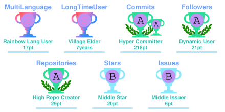
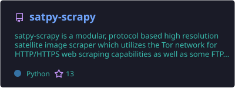
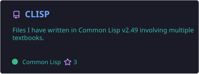
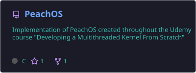
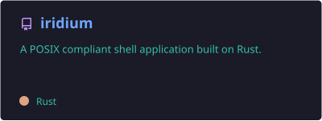
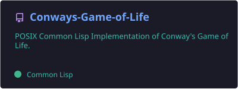
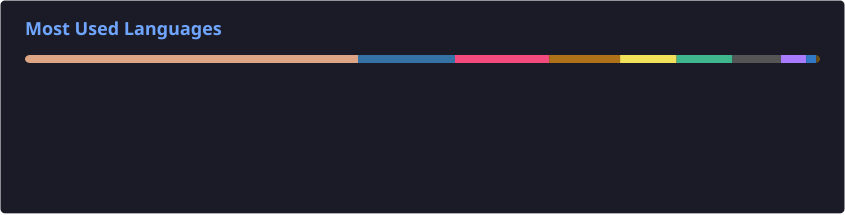

</img>

  

## About Me

- Currently working at **Kratos Defense & Security Solutions**.
- Specialize in **Microservice Architecture, Middleware Design, SATCOM, Ground Systems, & C2 Services**.
- 2019 Graduate of **Salisbury University** with a Bachelor's in **Computer Science**.
- My GitHub is for personal projects, learning new tools/languages, & contributing to the open source community!
- Feel free to reach out to me at my pinned socials below.

## Github Trophies

## Featured Repositories

<!-- FEATURED_REPOSITORIES_START -->

  
  
  
  
  
  

<!-- FEATURED_REPOSITORIES_END -->

## Active Languages Chart

## My Statistics

  

## Chess Statistics

<!--START_SECTION:chessStats-->
<!-- Automatically generated with https://github.com/Balastrong/chess-stats-action -->

| Type | Rapid ⏲️ | Blitz ⚡ | Bullet 🔫 |
|:---:|:---:|:---:|:---:|
| Current | 969 | 570 | 187 |
| Best | 1227 | 748 | 370 |

| White ⚪ | Black ⚫ | Result 🏆 | Date 📅 | Position 🗺️ | Type 🕕 |
|:---:|:---:|:---:|:---:|:---:|:---:|
| **xTriixrx** | miko08012012 | resigned ❌ | 27/9/2026 | <a href="http://www.ee.unb.ca/cgi-bin/tervo/fen.pl?select=k7/8/8/2p4P/8/3rb1P1/6K1/8 b - - 0 47">Link</a> | Rapid |
| IliaBalu | **xTriixrx** | resigned ❌ | 27/9/2026 | <a href="http://www.ee.unb.ca/cgi-bin/tervo/fen.pl?select=r2q1rk1/1pp3pp/5n2/p3p3/P1NpP3/3P2QP/1Pn1NPP1/2R2RK1 b - - 5 17">Link</a> | Rapid |
| **xTriixrx** | FARIALUCIANO | resigned ❌ | 27/9/2026 | <a href="http://www.ee.unb.ca/cgi-bin/tervo/fen.pl?select=3r1bnr/5pp1/1pkp3p/1Np5/5B2/8/2P2PPP/R3R1K1 w - - 4 23">Link</a> | Rapid |
| Rio_Flash | **xTriixrx** | checkmated ❌ | 27/9/2026 | <a href="http://www.ee.unb.ca/cgi-bin/tervo/fen.pl?select=r1bq1rk1/pp3ppQ/2p5/3pP3/8/2PB4/P1P2PPP/R1B1K2R b KQ - 0 12">Link</a> | Rapid |
| **xTriixrx** | mygdalias | win 🥇 | 27/9/2026 | <a href="http://www.ee.unb.ca/cgi-bin/tervo/fen.pl?select=r2n2Q1/3kb3/pp2p2p/4N3/P1qP1B2/2P5/5PPP/R3R1K1 b - - 0 21">Link</a> | Rapid |
| kontolbogem | **xTriixrx** | win 🥇 | 27/9/2026 | <a href="http://www.ee.unb.ca/cgi-bin/tervo/fen.pl?select=r3kb1r/pp3ppp/2pq4/2n5/1Q3Pb1/2P1B1P1/PP5P/RN2KB1R b KQkq - 1 14">Link</a> | Rapid |
| XtraMust4rd | **xTriixrx** | win 🥇 | 27/9/2026 | <a href="http://www.ee.unb.ca/cgi-bin/tervo/fen.pl?select=2q5/5k2/2KP1P2/2B3Pp/8/8/8/8 w - - 1 53">Link</a> | Rapid |
| **xTriixrx** | thakurashok618 | win 🥇 | 26/9/2026 | <a href="http://www.ee.unb.ca/cgi-bin/tervo/fen.pl?select=1RQ5/3k2p1/p5r1/B2p1n2/3P1P2/7P/PP3RP1/6K1 b - - 0 37">Link</a> | Rapid |
| **xTriixrx** | Chodeli | resigned ❌ | 26/9/2026 | <a href="http://www.ee.unb.ca/cgi-bin/tervo/fen.pl?select=r1b2rk1/ppPp1ppp/8/4P3/2B5/8/P1Pq2PP/R4QK1 w - - 0 19">Link</a> | Rapid |
| djpanchal021 | **xTriixrx** | resigned ❌ | 26/9/2026 | <a href="http://www.ee.unb.ca/cgi-bin/tervo/fen.pl?select=2r2k2/R4pp1/7p/1Np5/4P2P/P5P1/2K1BP2/8 b - - 0 37">Link</a> | Rapid |

<!--END_SECTION:chessStats-->

 

<!-- Dev Joke -->

<i>A dev joke for making it this far!</i>

<!-- Footer -->

 

<i>The key to immortality is living a life worth remembering. - Bruce Lee</i>

